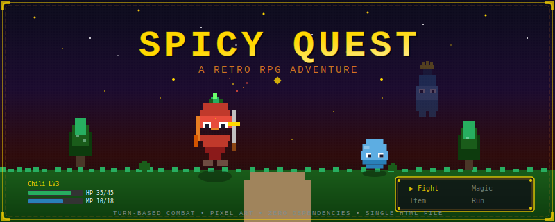

  

  
  
  
  

---

## 概要

**Spicy Quest** は、単一HTMLファイルで作られた軽量レトロRPGです。依存関係ゼロで、ブラウザですぐにプレイできます。

**Chili**（唐辛子の勇者）となり、**Frost King** を倒してスパイス王国に味を取り戻そう！

## 特徴

- **ターンベースバトル** -- ドラクエ風のコマンド選択式戦闘（たたかう/まほう/どうぐ/にげる）
- **ピクセルアート** -- Canvas APIで描画された手作りスプライト
- **レトロサウンド** -- Web Audio APIによる8bit風効果音
- **3つのマップ** -- スパイス村、スパイシーの森、フロスト城
- **NPC会話** -- 村人、商人、ヒーラーと会話
- **レベルアップ** -- 経験値を獲得してLV1〜5に成長、新魔法を習得
- **ボス戦** -- フロスト城でFrost Kingと決戦
- **セーブ/ロード** -- 自動的にlocalStorageに保存
- **依存関係ゼロ** -- 単一HTMLファイル、ビルド不要

## 遊び方

1. `index.html` をダウンロード
2. ブラウザで開く
3. プレイ開始！

### 操作方法

| キー | アクション |
|------|-----------|
| 矢印キー / WASD | 移動 |
| Enter / Z / Space | 決定 / 調べる |
| Escape / X | キャンセル / メニュー |

### ヒント

- 村の**長老**に話しかけて冒険の目的を聞こう
- **ヒーラー**に話しかけるとHP/MPが全回復
- **スパイシーの森**でアイテムとEXPを集めよう
- Frost Kingに挑む前に **LV3以上** がおすすめ
- LV2で覚える **Chili Storm** が強力！

## 世界観

| 場所 | 説明 |
|------|------|
| Spice Village | 安全な最初の村 |
| Spicy Forest | ランダムエンカウントのある森 |
| Frost Castle | 危険なダンジョン、最深部にボス |

## 技術仕様

- **エンジン:** HTML5 Canvas API
- **解像度:** 320x240（`image-rendering: pixelated` で拡大）
- **オーディオ:** Web Audio API（オシレーターベース）
- **セーブ:** localStorage
- **ファイルサイズ:** 約25KB

## ライセンス

[MIT](LICENSE) -- 自由に使用・改変・配布可能。
